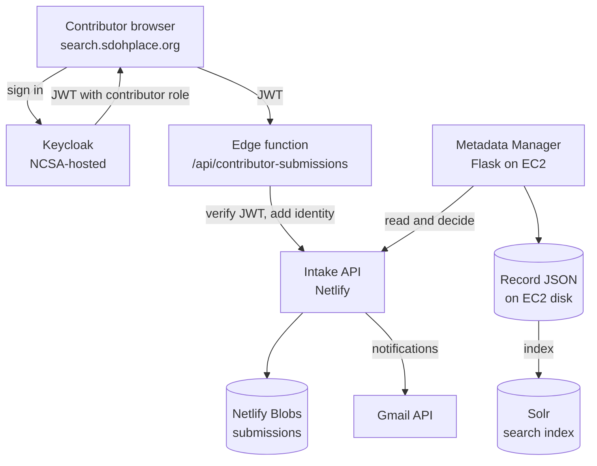

# SDOH & Place Project - Data Discovery

This [data discovery application](https://search.sdohplace.org) is one component of the [SDOH & Place Project](https://sdohplace.org), an effort by the [Healthy Regions & Policies Lab](https://healthyregions.org) (University of Illinois, Urbana-Champaign) to create a community of practice around geospatial public health data, specifically in the context of Social Determinants of Health.

The purpose of the data discovery application is to provide a curated and easy-to-search index of geospatial datasets that are especially useful within this research framework.

The platform itself is a NextJS application that interfaces with a Solr index. The Solr configuration, schema of the records, and all of the records themselves, are stored in our [metadata manager](https://github.com/healthyregions/sdohplace-metadatamanager), which is deployed at [metadata.sdohplace.org](https://metadata.sdohplace.org).

The structure of this application is inspired by [GeoBlacklight](https://geoblacklight.org), whose associated [OGM Aardvark](https://opengeometadata.org/ogm-aardvark/) metadata schema is the foundation of our own metadata schema. Instead of implementing GeoBlacklight proper, however, we have instead built this custom frontend app to query and interface with the Solr index.

## Dev install

We use the latest [Netlify Edge feature](https://www.netlify.com/platform/core/edge) to host the middle-layer API for LLM calls while keeping the site statically hosted, maintaining our existing setup. Netlify Edge is an advanced feature that will also allow us to localize content, serve relevant ads, authenticate users, personalize content, redirect visitors, and much more in the future. This feature allows us to implement, test and deploy both server-based api calls and static content in the same environment.

1. (One-time setup) To install the app locally, run:

    ```
    git clone https://github.com/healthyregions/sdohplace-data-discovery
    cd sdohplace-data-discovery
    yarn install
    ```

2. Set up environment variables:

    ```
    cp .env.local.example .env
    ```

    Update environment variables as needed. See the explanation in `.env.local.example` for what variables need to be setup.

### Keycloak frontend setup

Contributor login uses the frontend Keycloak client configuration in `.env`:

```env
NEXT_PUBLIC_KEYCLOAK_ISSUER=...
NEXT_PUBLIC_KEYCLOAK_CLIENT_ID=...
NEXT_PUBLIC_KEYCLOAK_SCOPE=openid profile email roles
NEXT_PUBLIC_KEYCLOAK_REQUIRED_ROLE=contributor
NEXT_PUBLIC_KEYCLOAK_REDIRECT_PATH=/sign-in
NEXT_PUBLIC_KEYCLOAK_POST_LOGOUT_REDIRECT_PATH=/
```

Local contributor submissions use the intake API configuration for the Netlify contributor-submissions function:

```env
INTAKE_API_BASE_URL=http://localhost:9090
INTAKE_API_TOKEN=change-me
```

Do not prefix the intake token with `NEXT_PUBLIC_`; it must stay server-side in the Netlify function environment.

For local development, make sure the Keycloak client includes exact matches for the frontend URLs you use:

- Valid redirect URIs: `http://localhost:3000/sign-in`, `http://localhost:8888/sign-in`
- Valid post logout redirect URIs: `http://localhost:3000/`, `http://localhost:8888/`
- Web origins: `http://localhost:3000`, `http://localhost:8888`

If you are testing the Netlify local setup, `netlify dev --port=8888` (i.e. `npm run dev:full`) uses `8888` as the browser-facing origin and proxies the Next app running on `3000`, so Keycloak settings for `8888` must be present.

3. To run the app locally, use:

    ```
    npm run dev:full
    ```

    This will start both the Netlify local proxy and the Next app. `localhost:8888` is the Netlify-facing local URL, and `localhost:3000` is the underlying Next dev server.

    For auth or Edge Function testing, use `localhost:8888`. For plain frontend-only testing, `localhost:3000` is also available.

4. To build and view the entire site locally, use

    ```
    yarn build
    yarn start
    ```

## Maintaining search prompts

Search prompts are maintained as markdown files in `config/prompt/markdown/` and compiled into `config/prompt/generated/prompt_bundle.js` for the Netlify Edge runtime.

- Edit `search-system.md` for shared system behavior, JSON output rules, Solr query construction, examples, and language-independent search logic.
- Edit `mode-off.md`, `mode-deterministic.md`, or `mode-prompt.md` for behavior specific to each ontology search mode.
- Edit `non-latin-instruction.md` for multilingual response rules.
- Run `npm run prompts:build` after changing any prompt markdown file.
- `npm run dev`, `npm run dev:full`, `npm run dev:edge`, `npm run dev:netlify`, and `npm run build` run the prompt build step automatically before starting.
- Do not edit `config/prompt/generated/prompt_bundle.js` directly; it is regenerated from the markdown files.

## Running with Docker
We also provide a Docker Compose recipe for building and running a local instance of the app.

> [!NOTE]
> We still need to update the Docker build to incorporate the middle-layer Netlify API.

To build the image:
```
docker compose build
```
NOTE: this is a shorthand for running `docker build -t herop/sdohplace-data-discovery .`

To run the application:
```bash
docker compose up -d
```
NOTE: this is a shorthand for running `docker run -it -p 8080:80 --env-file .env --name sdohplace-data-discovery herop/sdohplace-data-discovery`

Navigate to http://localhost:8080 to access the running application

To build and run in a single step:
```bash
docker compose up -d --build
```

To shut down the application:
```bash
docker compose down
```
NOTE: this is a shorthand for running `docker rm -f sdohplace-data-discovery`

## Data contribution feature

Contributors sign in with Keycloak, submit dataset metadata, and track it until
it is published. Reviewers work in the Metadata Manager. Three services are
involved and none of them talk to the browser directly except this one.

### Architecture



The browser never holds the intake API token. It sends a Keycloak JWT to the
edge function, which verifies the signature, checks the `contributor` role, and
only then calls the intake API with the shared bearer token.

### Submission lifecycle

| Status | Set by | Contributor can edit | Contributor can delete | Visible to reviewers |
|---|---|---|---|---|
| `draft` | Contributor saves | yes | yes | no action needed |
| `submitted` | Contributor submits | no | no | yes, awaiting review |
| `needs_changes` | Reviewer | yes | no | waiting on contributor |
| `approved` | Reviewer | no | no | ready to publish |
| `rejected` | Reviewer | yes | yes | closed |

Approval and publication are separate. `approved` means a reviewer accepted it;
the record only becomes searchable after an admin runs **Add Records** and
indexes to Solr.

### Where each part lives

| Feature | File |
|---|---|
| Sign in / out, token refresh, PKCE | `src/lib/auth.ts` |
| Auth state for React | `src/components/auth/AuthProvider.tsx` |
| Sign In / Sign Out buttons, `NEXT_PUBLIC_SHOW_SIGN_IN` | `src/components/NavBar.tsx` |
| OIDC callback page | `src/pages/sign-in.tsx` |
| Submission form fields and read-only mode | `src/components/contribute/SubmissionForm.tsx` |
| Submission list, detail, locked view | `src/components/contribute/ContributorSubmissionsPage.tsx` |
| Status rules and locked wording | `src/components/contribute/submissionDisplay.ts` |
| API calls and user-facing error text | `src/services/SubmissionService.ts` |
| Token verification, ownership checks (production) | `netlify/edge-functions/contributor-submissions.js` |
| Same proxy for `npm run dev` only | `src/pages/api/contributor-submissions/[[...path]].ts` |
| Storage, status transitions, all email | `sdohplace-intake-api` |
| Review UI, record creation, Solr indexing | `SDOHPlace-MetadataManager` |

### Points to remember

- **Two request paths.** `npm run dev` uses the Next API route; production uses
  the edge function. A change to one usually needs the same change to the other,
  and a bug in the edge function will not reproduce locally.
- **The edge function declares its own route** through `export const config` at
  the bottom of the file. Declaring it in `netlify.toml` instead does not work
  alongside `@netlify/plugin-nextjs`, and single-submission URLs silently 404.
- **`NEXT_PUBLIC_*` is inlined at build time.** Changing one in Netlify has no
  effect until the site is rebuilt.
- **This is a static export.** There is no server at runtime, so anything needing
  a secret has to be an edge function.
- **Ownership is enforced server-side** in the edge function, by Keycloak `sub`
  or email. Never rely on the UI hiding something.
- **`site_origin` travels with the submission** so notification links point back
  to the site it came from. Add new origins to `ALLOWED_SITE_ORIGINS` on the
  intake API or they fall back to production.
- **Email lives entirely in the intake API.** Do not add sending here or in the
  Metadata Manager.

## Testing the contribution feature

Run against production. Prefix every test title with `TEST -` so test data is
easy to find and remove afterwards. Both roles are needed: a contributor
account and a reviewer with the `metadata-manager` role in Keycloak.

Before starting, confirm `NEXT_PUBLIC_SHOW_SIGN_IN=true` is set on the
discovery site, otherwise the Sign In button is hidden.

### Contributor

| # | Do this | Expect |
|---|---|---|
| 1 | Sign In, authenticate with Keycloak | Returned to the site, signed in, **Contribute** appears |
| 2 | Contribute → New submission, fill the form, **Save Draft** | Saved as `draft`. **No email** |
| 3 | Reopen the draft and edit a field | All fields editable |
| 4 | **Submit for Review** | Status `submitted`. Email: "submission received" |
| 5 | Reopen the submitted item | Content visible, all fields greyed out, no Save or Submit buttons |
| 6 | Sign Out | Returned to the home page, still signed out, **not** bounced back to Keycloak |

### Reviewer

| # | Do this | Expect |
|---|---|---|
| 7 | Sign in to the Metadata Manager, open the submission | Full metadata visible |
| 8 | Leave Admin Notes empty, click **Needs Changes** | Blocked with a message asking for notes |
| 9 | Add notes, click **Needs Changes** | Contributor emailed, notes included verbatim |
| 10 | Click **Approve** | Contributor emailed "approved" |
| 11 | Approved tab → **Add Records**, then index to Solr | Contributor emailed "now live" |
| 12 | Delete the record | Contributor emailed "record removed" |

### Round trip

| # | Do this | Expect |
|---|---|---|
| 13 | As contributor, open the `needs_changes` item | Editable again, reviewer notes shown |
| 14 | Edit and resubmit | Reviewers emailed "resubmitted after changes" |
| 15 | As reviewer, **Reject** with notes | Contributor emailed, item becomes editable and removable |
| 16 | As contributor, delete the rejected item | Reviewers emailed "withdrawn by contributor" |

### Checking links and cleanup

Every link in a contributor email must point to the site the submission was made
from. A production submission must never produce a `localhost` link, and a
preview submission must never produce a production link.

Delete the test submissions and records when finished, then confirm in the
sending account's **Sent** folder that each expected email went out. The full
list of emails and their triggers is in the intake API README.

### If something fails

Collect the submission id (`sub-####`), a screenshot of the error, and roughly
when it happened. Error messages in the UI include the address to send this to.
Netlify function logs for the intake API show `[email:sent]` and
`[email:failed]` lines for every attempt.

## Contributors

Adam Cox, Pengyin Shan, Sara Lambert, Shubham Kumar
